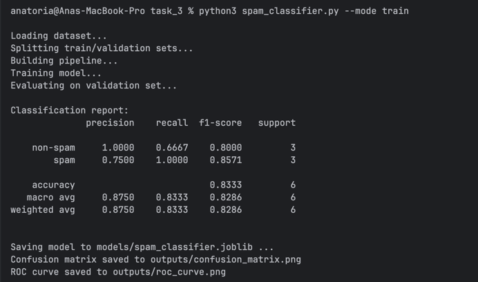
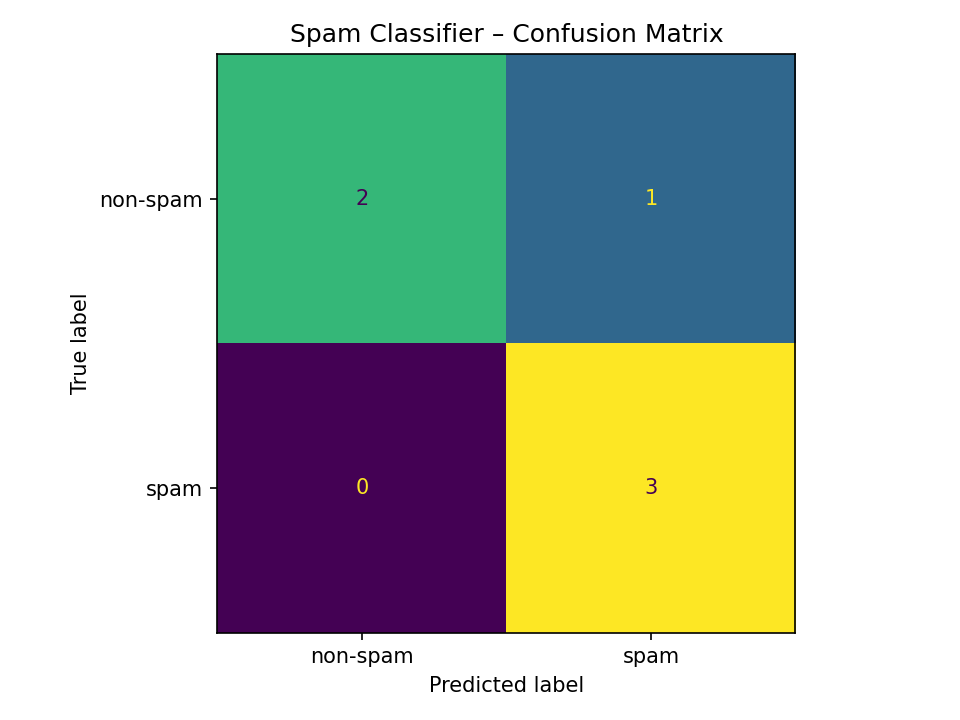
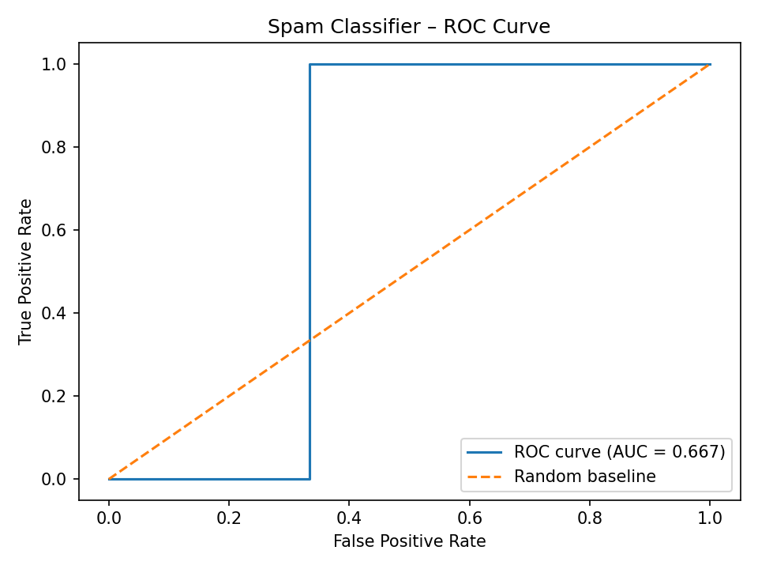
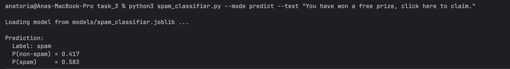
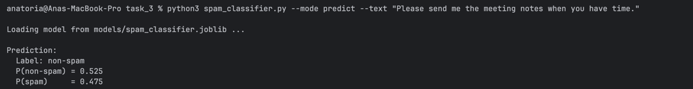

# Spam vs. Non‑Spam Email Classifier

## Overview

This task implements a complete machine learning workflow for detecting spam email messages. The system reads and processes a labeled dataset of email text, converts the messages into TF‑IDF features, trains a Logistic Regression classifier, evaluates its performance, and provides an interface for classification of new messages.

This documentation explains how to run, understand, and extend the project. Visual elements are included by referencing generated output images and placeholders for screenshots you will provide.

---

## Project Structure

```
task_3/
│
├── spam_classifier.py
├── README.md
│
├── data/
│   └── spam.csv
│
├── models/
│   └── spam_classifier.joblib
│
└── outputs/
    ├── confusion_matrix.png
    └── roc_curve.png
```

---

## Dataset

The dataset must be placed in:

```
task_3/data/spam.csv
```

Required format:

```
label,text
non-spam,Hi, are we still meeting tomorrow?
spam,WIN a FREE iPhone today!!! Click to claim.
```

Only two labels are used:

* spam
* non-spam

The dataset included with this project contains realistic examples of promotional spam, phishing attempts, credential theft attempts, scams, and normal workplace communication.

---

## Training the Model

Run the training phase using:

```
python3 spam_classifier.py --mode train
```

During training, the script:

1. Loads the dataset.
2. Converts text into TF‑IDF vectors.
3. Trains the Logistic Regression classifier.
4. Prints evaluation metrics.
5. Saves the model to: `models/spam_classifier.joblib`.
6. Generates plots in `outputs/`.

### Training Output Screenshot Placeholder



---

## Visualizations

Two evaluation visualizations are generated automatically.

### Confusion Matrix

This plot shows predicted vs. true labels.



### ROC Curve

This graph compares the classifier against random chance and summarizes performance.



---

## Predicting New Emails

You can classify a single message using either direct text input or interactive mode.

### Method A – Command-line text input

```
python3 spam_classifier.py --mode predict --text "Your account will be closed unless you verify here."
```

### Method B – Interactive prediction

```
python3 spam_classifier.py --mode predict
```

Paste your message, then signal end-of-input.

### Prediction Screenshot Placeholders

Spam example:



Non‑spam example:



---

## How the Model Works

### Feature Extraction

TF‑IDF encodes word importance across the entire dataset, increasing weights for meaningful terms like “free”, “offer”, “click”, while reducing weights for common words.

### Classifier

Logistic Regression is chosen because it:

* handles high-dimensional TF‑IDF features well,
* provides probabilistic outputs,
* is computationally efficient,
* performs strongly on text classification tasks.
